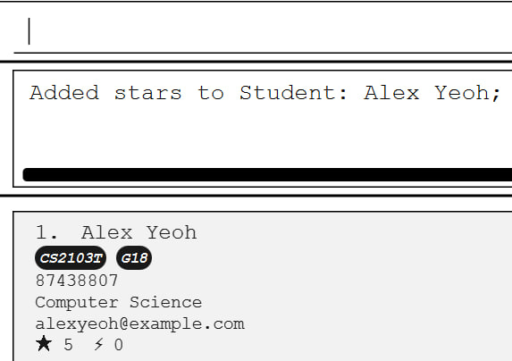
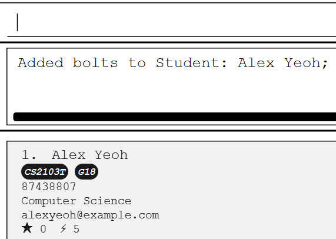
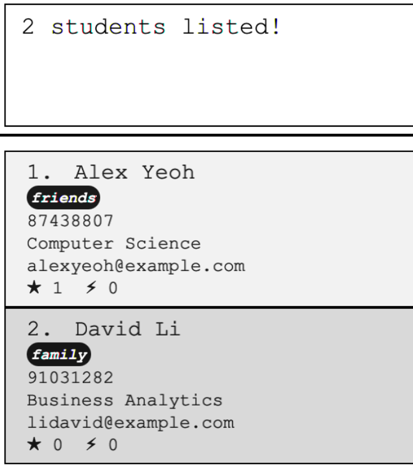
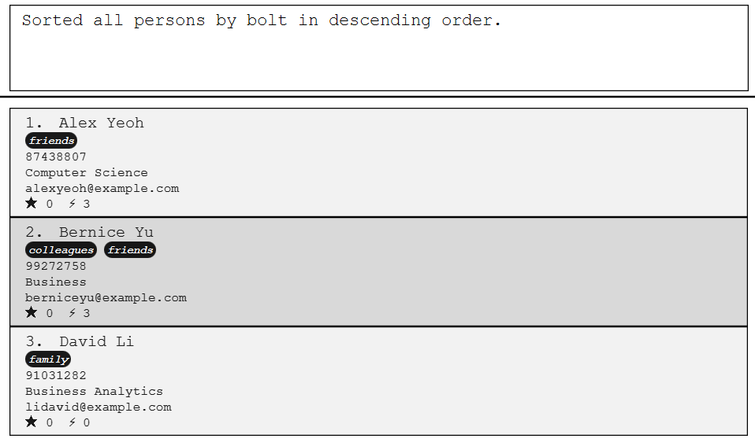

ClassMonitor is a **desktop app for managing student performances, optimized for use via a Command Line Interface** (CLI) while still having the benefits of a Graphical User Interface (GUI). If you can type fast, ClassMonitor can get your contact management tasks done faster than traditional GUI apps.

## Introduction
ClassMonitor is a Student Management System that empowers Teaching Assistants(TA) and Professors to manage their student particulars and obtain insights about their students' performance ratings. As a TA, you can easily view and edit your students' particulars during your daily classes. Utilize ClassMonitor’s flexible tagging system to help you organize your students according to their modules and classes. Finally, streamline your performance grading decisions by deriving insights from your students' performance indicators across time, through ClassMonitor’s statistics – you can allocate stars to students for good performance and bolts for bad performance!

For a more detailed view of ClassMonitor’s features, you can refer to the Features section below!
With a focus on efficiency, you can interact with ClassMonitor without ever reaching for your mouse or moving away from your keyboard! With a focus on user-friendliness, ClassMonitor is easy to learn!

This User Guide provides an in-depth documentation, so you can easily use and integrate ClassMonitor into your day-to-day classes as a Professor or TA. It covers how to launch ClassMonitor, core ClassMonitor features and commands, common terms and definitions used in ClassMonitor, and some troubleshooting recommendations. Head over to How to use the User Guide to get started!


--------------------------------------------------------------------------------------------------------------------

## Quick start

1. Ensure you have Java `11` or above installed in your Computer. You can download it [here](https://docs.oracle.com/en/java/javase/11/install/overview-jdk-installation.html#GUID-8677A77F-231A-40F7-98B9-1FD0B48C346A).

1. Download the latest `classmonitor.jar` from [here](https://github.com/AY2324S2-CS2103T-F13-4/tp/releases).

1. Copy the file to the folder you want to use as the _home folder_ for your ClassMonitor.

1. Open a command terminal, `cd` into the folder you put the jar file in, and use the `java -jar classmonitor.jar` command to run the application.<br>
   A GUI similar to the below should appear in a few seconds. Note how the app contains some sample data.<br>
   

1. Type the command in the command box and press Enter to execute it. e.g. typing **`help`** and pressing Enter will open the help window.<br>
   Some example commands you can try:

   * `list` : Lists all contacts.

   * `add n/John Doe p/98765432 e/johnd@example.com m/Computer Science` : Adds a contact named `John Doe` to the list.

   * `edit 1 n/John Damith` : Edits the name of the first person in the student list to be John Damith.

   * `delete 3` : Deletes the 3rd contact shown in the current list. Use this only after you have populated your student list.

   * `star 1 s/3` : Adds 3 stars to the first person on the list. Use this only after you have populated your student list.

   * `bolt 1 b/3` : Adds 3 bolts to the first person on the list. Use this only after you have populated your student list.

   * `sort major asc` : Sorts the students list based on the `major` fields in an ascending order.

   * `find name Alex` : Finds all the students who has the the Alex, either as their first or last name.

   * `clear` : Deletes all contacts. Use this responsibly.

   * `exit` : Exits the app.

1. Refer to the [Features](#features) below for details of each command.

--------------------------------------------------------------------------------------------------------------------

## Features

```note
* Words in `UPPER_CASE` are the parameters to be supplied by the user.<br>
  e.g. in `add n/NAME`, `NAME` is a parameter which can be used as `add n/John Doe`.

* Items in square brackets are optional.<br>
  e.g `n/NAME [t/TAG]` can be used as `n/John Doe t/friend` or as `n/John Doe`.

* Items with `…`​ after them can be used multiple times including zero times.<br>
  e.g. `[t/TAG]…​` can be used as ` ` (i.e. 0 times), `t/friend`, `t/friend t/family` etc.

* Command outputs with `[...]` refers to a truncated output for brevity in the User Guide. Within the app, additional details may be displayed.

* Parameters can be in any order.<br>
  e.g. if the command specifies `n/NAME p/PHONE_NUMBER`, `p/PHONE_NUMBER n/NAME` is also acceptable.

* Extraneous parameters for commands that do not take in parameters (such as `help`, `list`, `exit` and `clear`) will be ignored.<br>
  e.g. if the command specifies `help 123`, it will be interpreted as `help`.

* If you are using a PDF version of this document, be careful when copying and pasting commands that span multiple lines as space characters surrounding line-breaks may be omitted when copied over to the application.
</div>
```

#### `help` - to view help

> Format: **`help`**

Shows a message explaining how to access the help page.


#### `add` - to add a student to ClassMonitor

> Format: `add n/NAME p/PHONE_NUMBER e/EMAIL m/MAJOR [t/TAG]…`

<div markdown="span" class="alert alert-primary">:bulb: **Tip:**
A student can have any number of tags (including 0)
</div>

Examples:

**Command Input**: `add n/John Doe p/98765432 e/johnd@u.nus.edu m/Computer Science`

**Assumptions**:
* A student by the name of `John Doe` **(case-sensitive)** does not already exist. 

**Warning**:
* Names must have alphanumeric characters! Please avoid using special characters such as `\`. If such special characters exists in the person's name, please remove the character before adding the student into ClassMonitor.
* Please avoid specifying _any_ additional tags for the add commands besides the ones specified in the command format

**Command Output**: `New student added: John Doe; Phone: 98765432; Email: johnd@u.nus.edu; Major: Computer Science; Tags: `

#### `list` - lists all students

> Format: `list`

<div markdown="span" class="alert alert-primary">:bulb: **Tip:**
`list` sorts students' names in ascending order
</div>

#### `edit` : edits a student's information

> Format: `edit INDEX [n/NAME] [p/PHONE] [e/EMAIL] [m/MAJOR] [s/STAR] [b/BOLT] [t/TAG]…​`

**Info:**
* Edits the student at the specified `INDEX`. The index refers to the index number shown in the displayed student list. ​
* At least one of the optional fields must be provided.
* Existing values will be updated to the input values.

**Note:**
* `INDEX` *must be a positive integer* (e.g. 1, 2, 3, …) ​
* `NAME` *must **ONLY** contain alphabets and spaces*
* `PHONE` *should be a valid phone number*
* `EMAIL` *must **ONLY** contain alphanumerical characters and should be a valid email*
* `MAJOR` *must **ONLY** contain alphabets and spaces and should be a valid major*
* `STAR/BOLT` *must be a positive integer between 1 and 50,000* (e.g. 1, 2, …, 50,000) ​
* `TAG` **should be a valid course code or class code**

**Tip:**
* When editing tags, the existing tags of the student will be removed i.e adding of tags is not cumulative.
* You can remove all the student’s tags by typing `t/` without specifying any tags after it.
* Editing the number of stars of a student replaces the existing value.

**Examples:**
*  `edit 1 p/98765432 e/johndoe@u.nus.edu` Edits the phone number and email address of the 1st student to be `91234567` and `johndoe@example.com` respectively.
*  `edit 2 n/Betsy Crower t/` Edits the name of the 2nd student to be `Betsy Crower` and clears all existing tags.
*  `edit 3 s/0 b/0` Edits both the total number of stars and the total number of bolts received by student to be `0`. 

#### `star` - awards for good participation :

> Format: `star INDEX s/STAR`

**Info:**
* Edits the student at the specified `INDEX`. The index refers to the index number shown in the displayed student list. ​ 
* `STAR` refers to the number of stars to be awarded to the student. ​ 


**Note:**
* `INDEX` **must be a positive integer** (e.g. 1, 2, 3, …)
* `STAR` **must be a positive integer between 1 and 10** (e.g. 1, 2, ..., 10)
* The `STAR` will add onto existing number of stars the student already has.
* A student can only hold a accumulative maximum of 50,000 stars, with a minimum of 0 stars.

**Example:**

**Command Input**: `star 1 s/5`

**Assumptions**:
* Alex Yeoh is the student at Index 1
* He currently has 0 stars

**Command Output**: `Added stars to Student: Alex Yeoh; [...]`



#### `bolt` - records late coming and absence for class

**Format**: `bolt INDEX b/BOLT`

**Info:**
* The number of bolts corresponds to the number of times the student is absent. ​
* Edits the student at the specified `INDEX`. The index refers to the index number shown in the displayed student list. ​ 
* `BOLT` refers to the number of bolts to be awarded to the student. ​

**Note:**
`INDEX` **must be a positive integer** (e.g. 1, 2, 3, …) ​ 
* `BOLT` **must be a positive integer between 1 and 10** (e.g. 1, 2, ..., 10) ​ 
* The `BOLT` will add onto existing number of bolts the student already has. ​ 
* A student can only hold a accumulative maximum of 50,000 bolts, with a minimum of 0 bolts. ​

**Example:**

**Command Input**: `bolt 1 b/5`

**Assumptions**:
* Alex Yeoh is the student at Index 1
* He currently has 0 bolts

**Command Output**: `Added bolts to Student: Alex Yeoh; [...]`



#### `find` - finds all students that has an attribute

> Format: `find FIELD CRITERIA`

**The parameters for `CRITERIA` depends on the `FIELD` specified:**
* `find name KEYWORD [MORE KEYWORDS]`: Finds students with names that match **any** of the given keywords.
    * The order of the keywords does not matter. e.g. `Hans Bo` will match `Bo Hans`
    * Only full words will be matched. e.g. `Han` will not match `Hans`
    * Students matching at least one keyword will be returned (i.e. `OR` search).
      e.g. `find name Hans Bo` will return `Hans Gruber`, `Bo Yang`
* `find major KEYWORD`: Finds students with majors that **contain** the given keyword.
    * e.g. `find major Science` will return `Computer Science` majors and `Science` majors.
* `find star OPERATOR NUMBER`: Finds students with stars within the bounds as specified by the given operator and number.
    * e.g. `find star = 0` will return students with **0** stars.
* `find bolt OPERATOR NUMBER`: Finds students with bolts within the bounds as specified by the given operator and number.
    * e.g. `find bolt < 5` will return students with less than 5 stars.
* `find tag KEYWORD`: Finds students with tags that **contain** the given keyword.
    * e.g. `find tag friend` will return students that are tagged `friend` or `friends`.

**Info:**
* Accepted fields are `name`, `major`, `star`, `bolt`, and `tag`.
* Accepted operators for `find star` and `find bolt` are:
  * < (strictly less than)
  * <= (less than or equal to)
  * \> (strictly more than)
  * \>= (more than or equal to)
  * = (equal to)
* Matching is case-insensitive.

**Examples**:

**Command Input**: `find name alex david`

**Assumptions**:
* **Alex Yeoh** is the only student whose name includes a word that matches `alex`.
* **David Li** is the only student whose name includes a word that matches `david`.

**Command Output**: `2 students listed!`
* `find name alex david` returns `Alex Yeoh`, `David Li`





#### `sort` - sorts all students by a specified field
> Format: `sort FIELD ORDER`

**Info**:
* The only accepted fields are `name`, `phone`, `email`, `major`, `star`, `bolt`
* The only accepted orders are `asc` for ascending order of the specific field or `desc` for descending order of the specific field
* `name` and `email` are sorted in lexicographical order while `phone`,`star` and `bolt` are sorted in numeric order
* The field and orders can have a combinations of capital and lower case letters
  e.g. `sort star asc`, `sort name ASc` and `sort Major desc` are valid
* For tie breaking between students that have the same value for a given field, name will be used as a tiebreaker

**Examples**:

**Command Input**:`sort bolt desc`

**Assumptions**:
* ClassMonitor contains three students **Alex Yeoh** with 3 bolts, **Bernice Yu** with 3 bolts, and **David Li** with 0 bolts

**Command Output**: `Sorted all persons by bolt in descending order.`
* `sort bolt desc` displays **Alex Yeoh** on the top of the students displayed, then **Bernice Yu**, followed by **David Li**



#### `delete` - deletes a student's particulars

Deletes the specified student from the list.

Format: `delete INDEX`

* Deletes the student at the specified `INDEX`.
* The index refers to the index number shown in the displayed students list.
* The index **must be a positive integer** 1, 2, 3, …​

Examples:
* `list` followed by `delete 2` deletes the 2nd student in the list.
* `find Betsy` followed by `delete 1` deletes the 1st student in the results of the `find` command.

#### `clear` - Clears all students' particulars
> Format: `clear`

<div markdown="span" class="alert alert-warning">:exclamation: **Caution:**
This is **NOT** an undo-able process. Once you `clear` ClassMonitor, it your data will be lost. So be careful and only use this once the semester is over and the previous semester's student data is no longer needed.
</div>

#### `exit` - exits the program
> Format: `exit`
<div markdown="span" class="alert alert-primary">:bulb: **Tip:**
You can also close the program by closing the tab using the x circle at the top left of the application interface.
</div>

## Additional Information
#### Saving the data

ClassMonitor data are saved in the hard disk automatically after any command that changes the data. There is no need to save manually.

#### Editing the data file

ClassMonitor data are saved automatically as a JSON file `[JAR file location]/data/classmonitor.json`. Advanced users are welcome to update data directly by editing that data file.

<div markdown="span" class="alert alert-warning">:exclamation: **Caution:**
If your changes to the data file makes its format invalid, ClassMonitor will discard all data and start with an empty data file at the next run. Hence, it is recommended to take a backup of the file before editing it.<br>
Furthermore, certain edits can cause the ClassMonitor to behave in unexpected ways (e.g., if a value entered is outside of the acceptable range). Therefore, edit the data file only if you are confident that you can update it correctly.
</div>

#### Archiving data files `[coming in v2.0]`

_Details coming soon ..._

--------------------------------------------------------------------------------------------------------------------

## FAQ

**Q**: How do I transfer my data to another Computer? <br>
**A**: Install the app in the other computer and overwrite the empty data file it creates with the file that contains the data of your previous ClassMonitor home folder.

**Q**: How do I deduct stars from a student? <br>
**A**: While explicitly deducting is currently not possible, the edit command can be used in the interim to 'deduct stars'. First identify the index of the student, INDEX. Then decide what the student's updated star count should be, STAR. Then run `edit INDEX s/STAR` as a way to reduce a students star count.
--------------------------------------------------------------------------------------------------------------------

## Known issues

1. **When using multiple screens**, if you move the application to a secondary screen, and later switch to using only the primary screen, the GUI will open off-screen. The remedy is to delete the `preferences.json` file created by the application before running the application again.

--------------------------------------------------------------------------------------------------------------------

## Command summary

Action | Format, Examples
--------|------------------
**Add** | `add n/NAME p/PHONE_NUMBER e/EMAIL m/MAJOR [t/TAG]…​` <br> e.g., `add n/James Ho p/83482048 e/jamesho@u.nus.edu m/Computer Science t/CS2103T t/G18`
**Clear** | `clear`
**Delete** | `delete INDEX`<br> e.g., `delete 3`
**Edit** | `edit INDEX [n/NAME] [p/PHONE_NUMBER] [e/EMAIL] [m/MAJOR] [t/TAG]…​`<br> e.g.,`edit 2 n/James Lee e/jameslee@u.nus.edu m/Psychology`
**Star** | `star INDEX s/STAR` <br> e.g., `star 1 s/5`
**Bolt** | `bolt INDEX b/BOLT` <br> e.g., `bolt 1 b/5`
**Find** | `find FIELD CRITERIA`<br> e.g., `find name alex david`
**Sort** | `sort FIELD ORDER`<br> e.g., `sort star asc`
**List** | `list`
**Help** | `help`
**Exit** | `exit`

