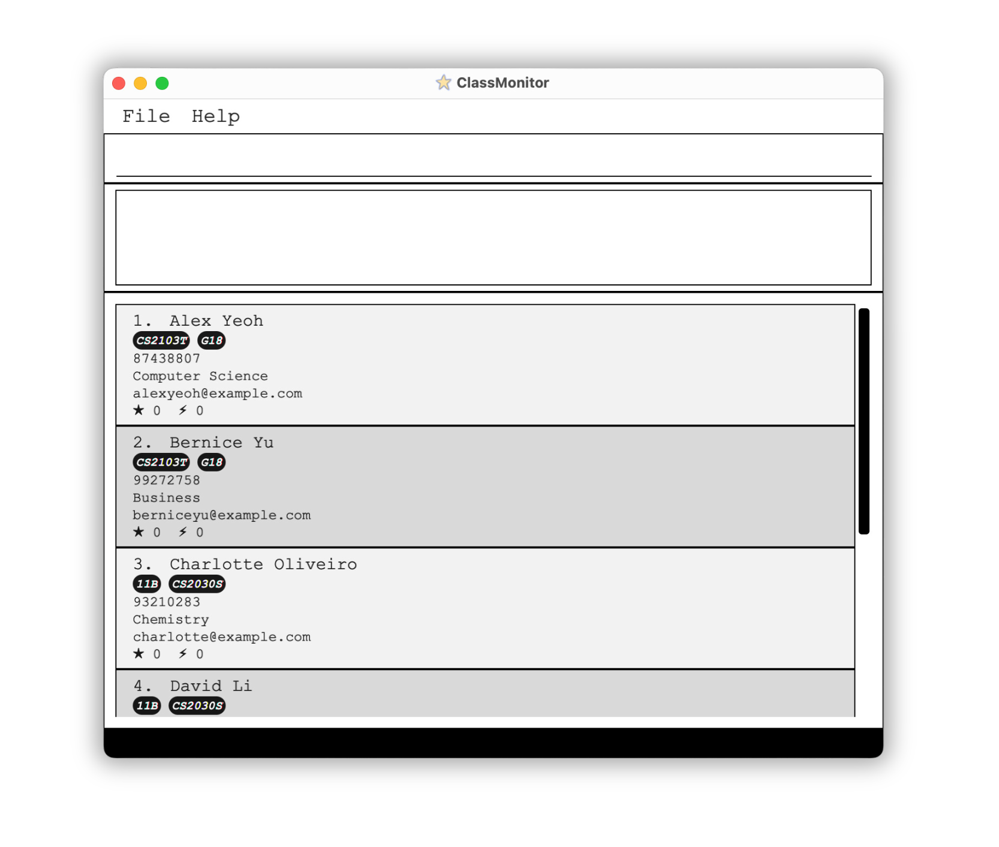

**_Greetings Teaching Assistants (TAs)!_** We understand that teaching is ... and it is difficult to If you feel like current student management systems are
* tedious?
* non-centralized

* time to ... 
* capacity to remember .... memory ... 
to effectively manage your class, we have a solution for you.

## About ClassMonitor
ClassMonitor is a Student Management System that empowers TAs and Professors to manage their student particulars and obtain insights about their students' performance ratings. As a TA, you can easily view and edit your students' particulars during your daily classes. Utilize ClassMonitor’s flexible tagging system to help you organize your students according to their modules and classes. Finally, streamline your performance grading decisions by deriving insights from your students' performance indicators across time, through ClassMonitor’s statistics – you can allocate stars to students for good class participation and bolts for absenteeism!

For a more detailed view of ClassMonitor’s features, you can refer to the Features section below!
With a focus on efficiency, you can interact with ClassMonitor without ever reaching for your mouse or moving away from your keyboard! With a focus on user-friendliness, ClassMonitor is easy to learn!

This User Guide provides an in-depth documentation, so you can easily use and integrate ClassMonitor into your day-to-day classes as a Professor or TA. It covers how to launch ClassMonitor, core ClassMonitor features and commands, common terms and definitions used in ClassMonitor, and some troubleshooting recommendations. Head over to [How to Use User Guide](#how-to-use-user-guide) to get started!

--------------------------------------------------------------------------------------------------------------------



--------------------------------------------------------------------------------------------------------------------

## Features

ClassMonitor provides two core features:

* Student Management System
* Student Analysis Tool

### Student Management System

ClassMonitor allows you to manage your classes and keep track of your student details.

1. Efficiently **create, view, edit and delete** your students' details.
2. **Sort** your students by their name, phone number, email address, major, number of stars and number of bolts.
3. **Tag** students in your current list using an efficient tagging system where you can create and edit existing tags.
4. **Filter** your students by their name, major, tags, number of stars and number of bolts.

### Student Analysis Tool

ClassMonitor collects and tracks the following data, allowing you to tailor your pedagogy for more effective teaching through **statistical analysis**:

1. Track students' **level of participation in class**.
2. Record your students' **attendance**.

--------------------------------------------------------------------------------------------------------------------

## Quick start

1. Ensure you have Java `11` or above installed in your Computer. You can download it [here](https://docs.oracle.com/en/java/javase/11/install/overview-jdk-installation.html#GUID-8677A77F-231A-40F7-98B9-1FD0B48C346A).

1. Download the latest `classmonitor.jar` from [here](https://github.com/AY2324S2-CS2103T-F13-4/tp/releases).

1. Copy the file to the folder you want to use as the _home folder_ for your ClassMonitor.

1. Open a command terminal. You can do this by searching for "Command Prompt" (for Windows) or "Terminal" (for Mac) in your computer's search bar.

1. In the command terminal, navigate to the folder where you placed the classmonitor.jar file. You can do this by using the "cd" command followed by the folder path. For example, if your file is in the "Downloads" folder, you would type: 
    ```
    cd Downloads
    ```
   
1. After navigating to the correct folder, type the following command and press Enter:
   ```
   java -jar classmonitor.jar
   ```
   This command launches ClassMonitor. After a few seconds, a Graphical User Interface (GUI) similar to the one shown in the image should appear. You'll see some sample data in the app.
   

1. Type the command in the command box and press Enter to execute it. E.g. typing **`help`** and pressing Enter will open the help window.<br>
   Some example commands you can try:

   * `list` : Lists all contacts.

   * `add n/Damith p/98765432 e/damith@uml.com m/Computer Science` : Adds a student named `Damith` to the list.

   * `edit 1 n/Damith Dalegend` : Edits the name of the first person in the student list to be `Damith Dalegend`.

   * `delete 1` : Deletes the 1st student shown in the current list. Use this only after you have populated your student list.

   * `star 1 s/3` : Adds 3 stars to the first student on the list. Use this only after you have populated your student list.

   * `bolt 1 b/3` : Adds 3 bolts to the first student on the list. Use this only after you have populated your student list.

   * `sort major asc` : Sorts the student list based on the `major` field in ascending order.

   * `find name Chitra` : Finds all students who have the name `Chitra`.

   * `clear` : Deletes all students. Use this responsibly.

   * `exit` : Exits ClassMonitor.

1. Refer to the [Commands](#commands) below for details of each command.

--------------------------------------------------------------------------------------------------------------------

## Commands

This section guides you through the precise execution of each command, ensuring optimal utilization.

```note
* Words in `UPPER_CASE` are the parameters to be supplied by the user.<br>
  E.g. in `add n/NAME`, `NAME` is a parameter which can be used as `add n/John Doe`.

* Items in square brackets are optional.<br>
  E.g `n/NAME [t/TAG]` can be used as `n/John Doe t/friend` or as `n/John Doe`.

* Items with `…`​ after them can be used multiple times including zero times.<br>
  E.g. `[t/TAG]…​` can be used as ` ` (i.e. 0 times), `t/friend`, `t/friend t/family` etc.

* Command outputs with `[...]` refers to a truncated output for brevity in the User Guide. Within the app, additional details may be displayed.

* Parameters can be in any order.<br>
  E.g. if the command specifies `n/NAME p/PHONE_NUMBER`, `p/PHONE_NUMBER n/NAME` is also acceptable.

* Extraneous parameters for commands that do not take in parameters (such as `help`, `list`, `exit` and `clear`) will be ignored.<br>
  E.g. if the command specifies `help 123`, it will be interpreted as `help`.

* If you are using a PDF version of this document, be careful when copying and pasting commands that span multiple lines as space characters surrounding line-breaks may be omitted when copied over to the application.
```

### Student Commands

#### `add` - adds a student to ClassMonitor

**Format:** `add n/NAME p/PHONE_NUMBER e/EMAIL m/MAJOR [t/TAG]…`

```info
* Adds a new student to ClassMonitor using the provided details and sets their initial star and bolt values to 0.
```

```note
* `NAME` *must **ONLY** contain alphanumeric characters and spaces*
* `PHONE_NUMBER` *must **ONLY** consist of numbers and be at least 3 digits long*
* `EMAIL` *must **ONLY** contain alphanumeric characters and follow the format of a valid email address, which is [**local-part@domain**]()*
* `MAJOR` *must **ONLY** contain alphabets and spaces*
* A student can have any number of tags (including 0)
```

```warning
For the best user experience,
* `PHONE_NUMBER`, `MAJOR`, `EMAIL`, `TAG` should be limited to 50 characters  or fewer
* `NAME` should be limited to 30 characters or fewer<br>
to ensure that all fields are fully visible on the screen without being cut off or truncated.

Please also avoid specifying _any_ additional flags besides the ones specified in the command format.
```

**Example:**


**Assumption:**

1. A student by the name of `John Doe` **(case-sensitive)** does not already exist.



#### `list` - lists all students

**Format:** `list`

```info
* Displays all students, clearing existing filters on the student list.
```

#### `edit` - edits a student's information

**Format:** `edit INDEX [n/NAME] [p/PHONE_NUMBER] [e/EMAIL] [m/MAJOR] [s/STAR] [b/BOLT] [t/TAG]…​`

```info
* Edits the student at the specified `INDEX`. The index refers to the index number shown in the displayed student list. ​
* At least one of the optional fields must be provided.
* Existing values will be updated to the input values.
```

```note
* `INDEX` *must be a positive integer* (e.g. 1, 2, 3, …) ​
* `NAME` *must **ONLY** contain alphanumeric characters and spaces*
* `PHONE_NUMBER` *must **ONLY** consist of numbers and be at least 3 digits long*
* `EMAIL` *must **ONLY** contain alphanumeric characters and follow the format of a valid email address, which is [**local-part@domain**]()*
* `MAJOR` *must **ONLY** contain alphabets and spaces*
* `STAR/BOLT` *must be an integer between 0 and 50,000* (e.g. 0, 1, 2, …, 50,000) ​
```

```tip
* When editing tags, the existing tags of the student will be removed i.e adding of tags is not cumulative.
* You can remove all the student’s tags by typing `t/` without specifying any tags after it.
* Editing the number of stars/bolts of a student replaces the existing value.
```

**Examples:**
*  `edit 1 p/98765432 e/johndoe@u.nus.edu` Edits the phone number and email address of the 1st student to be `98765432` and `johndoe@u.nus.edu` respectively.
*  `edit 2 n/Betsy Crower t/` Edits the name of the 2nd student to be `Betsy Crower` and clears all existing tags.
*  `edit 3 s/0 b/0` Edits both the total number of stars and the total number of bolts received by the 3rd student to be `0`. 

#### `star` - awards for good participation

**Format:** `star INDEX s/STAR`

```info
* Edits the student at the specified `INDEX`. The index refers to the index number shown in the displayed student list. ​ 
* `STAR` refers to the number of stars to be awarded to the student. ​ 
```

```note
* `INDEX` **must be a positive integer** (e.g. 1, 2, 3, …)
* `STAR` **must be a positive integer between 1 and 10** (e.g. 1, 2, ..., 10)
* The specified number of stars will be added to the student's current star count.
* A student can only accumulate a maximum of 50,000 stars and a minimum of 0 stars.
```

**Example:**


**Assumption:**

1. Alex Yeoh is the student at index 1
2. He currently has 0 stars



#### `bolt` - records absenteeism of student

**Format**: `bolt INDEX b/BOLT`

```info
* The number of bolts corresponds to the number of times the student is absent. ​
* Edits the student at the specified `INDEX`. The index refers to the index number shown in the displayed student list. ​ 
* `BOLT` refers to the number of bolts to be awarded to the student. ​
```

```note
`INDEX` **must be a positive integer** (e.g. 1, 2, 3, …) ​ 
* `BOLT` **must be a positive integer between 1 and 10** (e.g. 1, 2, ..., 10) ​ 
* The specified number of bolts will be added to the student's current bolt count.
* A student can only accumulate a maximum of 50,000 bolts and a minimum of 0 bolts.
```

**Example:**


**Assumption:**

1. Alex Yeoh is the student at index 1
2. He currently has 0 bolts



#### `find` - finds all students by a specified field

**Format:** `find FIELD CRITERIA`

```note
Accepted fields are `name`, `major`, `star`, `bolt`, and `tag`.

The parameters for `CRITERIA` depend on the `FIELD` specified.
```

| Field  | Criteria                     | Format, Examples                                                         |
|--------|---------------------------------------------------------------------------------------------------------|
| name   | KEYWORD [MORE_KEYWORDS]…​ | `find name KEYWORD [MORE_KEYWORDS]…​` <br> e.g. `find name Alex David`| 
| major  | SUBSTRING                    | `find major SUBSTRING` <br> e.g. `find major Science`                         | 
| star   | OPERATOR NUMBER              | `find star OPERATOR NUMBER` <br> e.g. `find star = 0`                        |
| bolt   | OPERATOR NUMBER              | `find bolt OPERATOR NUMBER` <br> e.g. `find bolt > 5`                        |
| tag    | SUBSTRING                    | `find tag SUBSTRING` <br> e.g. `find tag CS2103T`                             |

```info
* `find name`: Finds students with names that match **any** of the given keywords.
   * The order of the keywords does not matter. E.g. `Hans Bo` will match `Bo Hans`.
   * Only full words will be matched. E.g. `Han` will not match `Hans`.
   * Students matching at least one keyword will be returned (i.e. **OR** search).
   
* `find major`/`find tag`: Finds students with majors/tags that **contain** the given keyword.
   * `find major Science` will return students with `Computer Science` majors and `Science` majors.
   * `find tag CS` will return students with `CS2103T` tags and `CS2100` tags.

* `find star`/`find bolt`: Finds students with stars/bolts **within the bounds** as specified by the given operator and number.
   * Accepted operators are:
     * < (strictly less than)
     * <= (less than or equal to)
     * \> (strictly more than)
     * \>= (more than or equal to)
     * = (equal to)
   * Accepted numbers are integers in range [0, 2147483647].
```

**Example**:


**Assumption:**

1. **Alex Yeoh** is the only student whose name includes a word that matches `alex`.
1. **David Li** is the only student whose name includes a word that matches `david`.



```tip
Use the `list` command to view all students again.
```

#### `sort` - sorts all students by a specified field

**Format:** `sort FIELD ORDER`

```info
* Accepted fields are `name`, `phone`, `email`, `major`, `star`, `bolt`.
* Accepted orders are 
   * `asc` for ascending order of the specific field
   * `desc` for descending order of the specific field
* `name` and `email` are sorted in **lexicographical** order while `phone`,`star`, and `bolt` are sorted in **numeric** order
* The field and order can have combinations of capital and lower case letters.<br>
   E.g. `sort star asc`, `sort name ASc` and `sort Major desc` are valid
* For tie breaking between students that have the same value for a given field, name will be used as a tiebreaker.
```

**Example**:


**Assumption:**

1. Your current student lists consists of only 3 students, **Alex Yeoh**, **Bernice Yu**, and **David Li**.
1. **Alex Yeoh** has 3 stars
1. **Bernice Yu** has 2 stars
1. **David Li** has 1 star



#### `delete` - deletes a student's particulars

**Format:** `delete INDEX`

* Deletes the student at the specified `INDEX`.
* The index refers to the index number shown in the displayed students list.
* The index **must be a positive integer** 1, 2, 3, …​

**Examples:**
* `delete 2` deletes the 2nd student in the displayed list.
* `find name Alex` followed by `delete 1` deletes the 1st student in the results of the `find` command.

#### `clear` - Clears all students' particulars

**Format:** `clear`

```warning
This is **NOT** an undo-able process. Once you `clear` ClassMonitor, your data will be lost. So be careful and only use this once the semester is over and the previous semester's student data is no longer needed.
```

### General Commands

#### `help` - to view help

**Format:** `help`

```info
Shows a message explaining how to access the help page.
```


#### `exit` - exits ClassMonitor

**Format:** `exit`

```tip
You can also close the program by using the **x** circle at the top left of the application GUI.
```

## Command summary

| Action     | Format, Examples                                                                                                                                       |
|------------|--------------------------------------------------------------------------------------------------------------------------------------------------------|
| **Add**    | `add n/NAME p/PHONE_NUMBER e/EMAIL m/MAJOR [t/TAG]…​` <br> E.g., `add n/James Ho p/83482048 e/jamesho@u.nus.edu m/Computer Science t/CS2103T t/G18`    |
| **Clear**  | `clear`                                                                                                                                                |
| **Delete** | `delete INDEX`<br> E.g., `delete 3`                                                                                                                    |
| **Edit**   | `edit INDEX [n/NAME] [p/PHONE_NUMBER] [e/EMAIL] [m/MAJOR] [s/STAR] [b/BOLT] [t/TAG]…​`<br> E.g.,`edit 2 n/James Lee e/jameslee@u.nus.edu m/Psychology` |
| **Star**   | `star INDEX s/STAR` <br> E.g., `star 1 s/5`                                                                                                            |
| **Bolt**   | `bolt INDEX b/BOLT` <br> E.g., `bolt 1 b/5`                                                                                                            |
| **Find**   | `find FIELD CRITERIA`<br> E.g., `find name alex david`                                                                                                 |
| **Sort**   | `sort FIELD ORDER`<br> E.g., `sort star asc`                                                                                                           |
| **List**   | `list`                                                                                                                                                 |
| **Help**   | `help`                                                                                                                                                 |
| **Exit**   | `exit`                                                                                                                                                 |

## Additional Information

### Saving the data

ClassMonitor data are saved in the hard disk automatically after any command that changes the data. There is no need to save manually.

### Editing the data file

ClassMonitor data are saved automatically as a JSON file `[JAR file location]/data/classmonitor.json`. Advanced users are welcome to update data directly by editing that data file.

```danger
If your changes to the data file makes its format invalid, ClassMonitor will discard all data and start with an empty data file at the next run. Hence, it is recommended to save a backup of the file before editing it.<br>
Furthermore, certain edits can cause the ClassMonitor to behave in unexpected ways (e.g. if a value entered is outside of the acceptable range). Therefore, edit the data file only if you are confident that you can update it correctly.
```

### Archiving data files `[coming in v2.0]`

_Details coming soon ..._

## FAQ

**Q**: How do I transfer my data to another Computer? <br>
**A**: First, install the app on the other computer. Then, replace the empty data file it creates with the file containing your data from the previous ClassMonitor home folder.

**Q**: How do I deduct stars from a student? <br>
**A**: Currently, direct deduction of stars is not possible. However, you can achieve this by using the edit command temporarily. First, find the index of the student (`INDEX`). Next, determine the student's updated star count (`STAR`). Finally, use the command `edit INDEX s/STAR` to 'reduce' the student's star count.

## Known issues

1. **When using multiple screens**, if you move the application to a secondary screen, and later switch to using only the primary screen, the GUI will open off-screen. The remedy is to delete the `preferences.json` file created by the application before running the application again.

## Acknowledgements
ClassMonitor is a brownfield software project based off [AddressBook Level-3](https://se-education.org/addressbook-level3/), taken under the [CS2103T Software Engineering module](https://nus-cs2103-ay2324s1.github.io/website/index.html) held by the School of Computing at the National University of Singapore.

Java dependencies:
* [Jackson](https://github.com/FasterXML/jackson) for JSON-related operations
* [JavaFX](https://openjfx.io/) for GUI
* [JUnit5](https://github.com/junit-team/junit5) for testing

Documentation dependencies:
* [Jekyll](https://jekyllrb.com/) for rendering the website
* [PlantUML](https://plantuml.com/) for creating UML diagrams

Fonts used in ClassMonitor:
* ClassMonitor Website:
    * [Epilogue](https://fonts.google.com/specimen/Epilogue) by Tyler Finck
    * [Source Code Pro](https://fonts.google.com/specimen/Source+Code+Pro) by Paul D. Hunt

Other acknowledgments:
* Material Design Icons:
    * [star](https://www.canva.com/p/sketchify/?utm_medium=referral&utm_source=creator_share&utm_campaign=creator_share) by Sketchify on Canva as ClassMonitor's App Icon
* Font Awesome 6 icons:
    * [book](https://fontawesome.com/icons/book) as the "note" admonition icon
    * [circle-info](https://fontawesome.com/icons/circle-info) as the "info" admonition icon
    * [fire-flame-curved](https://fontawesome.com/icons/fire-flame-curved) as the "danger" admonition icon
    * [lightbulb](https://fontawesome.com/icons/lightbulb) as the "tip" admonition icon
    * [triangle-exclamation](https://fontawesome.com/icons/triangle-exclamation) as the "warning" admonition icon
* Code acknowledgements:
    * [Website Layout](https://github.com/AY2324S2-CS2103T-F13-4/tp/tree/master/docs) adapted from [AY2223S1-CS2103T-W16-2's tP Project](https://github.com/AY2223S1-CS2103T-W16-2/tp/tree/master/docs)
    * [Custom link fragment checker](https://github.com/AY2223S1-CS2103T-W16-2/tp/blob/master/cli-test/linkchecker/check-links.js) adapted from the [World Wide Web Consortium](https://github.com/w3c/node-linkchecker)
    * [Pure CSS auto-incrementing heading counters](https://github.com/AY2223S1-CS2103T-W16-2/tp/blob/master/docs/_sass/toc.scss) adapted from [@gvgramazio on StackOverflow](https://stackoverflow.com/a/51007932/9311854)
    * [PDF styling of HTML pages](https://github.com/AY2223S1-CS2103T-W16-2/tp/blob/master/docs/_sass/pdf.scss) following Michael Perrin's [tutorial](https://www.michaelperrin.fr/blog/2019/11/printing-the-web-part-2-html-and-css-for-printing-books)
    * [Pure liquid admonitions](https://github.com/AY2223S1-CS2103T-W16-2/tp/blob/master/docs/_sass/admonitions.scss) adapted from [@kimkyunghwan21 on GitHub](https://github.com/kimkyunghwan21/kimkyunghwan21.github.io/blob/master/_layouts/plugins/extension.liquid)
    * [Pure liquid HTML table-of-contents](https://github.com/AY2223S1-CS2103T-W16-2/tp/blob/master/docs/_includes/toc.html) from [@allejo on GitHub](https://github.com/allejo/jekyll-toc)
* Miscellaneous:
    * [Docusaurus](https://docusaurus.io/docs/markdown-features/admonitions) for admonition colors and styling
    * [SchemeColor](https://www.schemecolor.com/pastel-rainbow.php) for admonition colors
 
## Glossary

